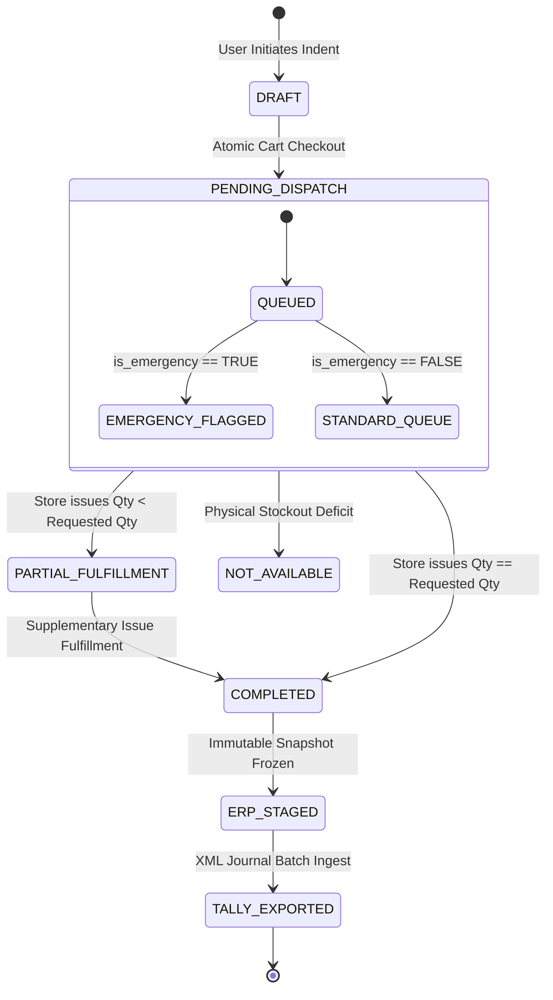
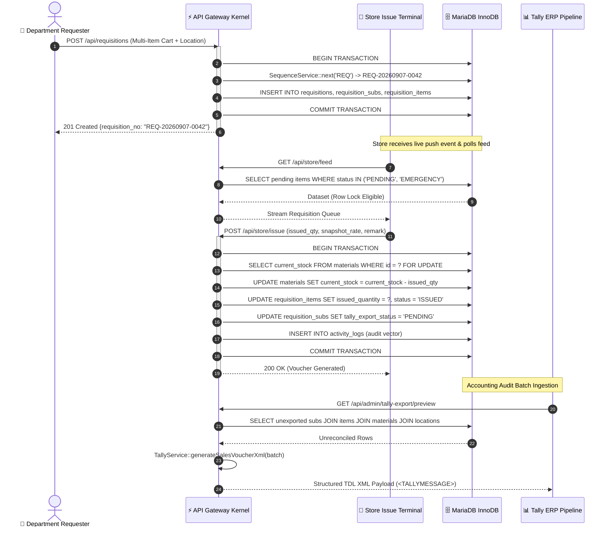

# ⚡ Requisition System by Piyush — Distributed Store & Material Distribution Platform

<div align="center">

[](https://php.net)
[](https://flutter.dev)
[](https://mariadb.org)
[](https://tallysolutions.com)
[](https://github.com/piyushmaji524/store-requisition-system)
[](LICENSE)
[](LICENSE)

<p align="center">
  <b>A Mission-Critical, High-Throughput Distributed Material Requisition, Real-Time Inventory Valuation, and Bidirectional ERP Accounting Orchestration System.</b>
</p>

</div>

---

## 📑 Table of Contents
- [1. Executive Architectural Summary](#1-executive-architectural-summary)
- [2. Mathematical & Formal Invariants](#2-mathematical--formal-invariants)
  - [2.1 Perpetual Valuation Formal Model](#21-perpetual-valuation-formal-model)
  - [2.2 Collision-Free Deterministic Sequence Generator](#22-collision-free-deterministic-sequence-generator)
  - [2.3 Requisition State-Machine Transition Theorem](#23-requisition-state-machine-transition-theorem)
- [3. System Topology & Deep Sequence Orchestration](#3-system-topology--deep-sequence-orchestration)
  - [3.1 High-Level Component Topology](#31-high-level-component-topology)
  - [3.2 Distributed Concurrent Issue Handshake](#32-distributed-concurrent-issue-handshake)
- [4. Kernel & Micro-Dispatcher Engine](#4-kernel--micro-dispatcher-engine)
  - [4.1 Zero-Overhead Routing Architecture](#41-zero-overhead-routing-architecture)
  - [4.2 Benchmarks & Micro-Performance Profile](#42-benchmarks--micro-performance-profile)
- [5. Subsystems & Domain Modules](#5-subsystems--domain-modules)
  - [5.1 Perpetual Stock Ledger & Snapshot Freezing](#51-perpetual-stock-ledger--snapshot-freezing)
  - [5.2 Bidirectional Tally Prime XML Pipeline](#52-bidirectional-tally-prime-xml-pipeline)
  - [5.3 Tri-Tier Reactive Flutter Client Terminals](#53-tri-tier-reactive-flutter-client-terminals)
- [6. Relational Persistence Schema & ER Graph](#6-relational-persistence-schema--er-graph)
- [7. Zero-Trust Security & Cryptographic Handshake](#7-zero-trust-security--cryptographic-handshake)
- [8. Observability, Telemetry & Structured Audit Trails](#8-observability-telemetry--structured-audit-trails)
- [9. Production Deployment & Sysctl Kernel Tuning](#9-production-deployment--sysctl-kernel-tuning)
- [10. Author & Architectural Invariants](#10-author--architectural-invariants)
- [11. Open Source License](#11-open-source-license)

---

## 1. Executive Architectural Summary

The **Requisition System by Piyush** is an enterprise-grade, organization-agnostic hybrid micro-monolith platform engineered to eliminate paper-based material indents, resolve non-deterministic supply-chain deficits, and maintain real-time perpetual inventory valuation across distributed industrial cost centers. 

The architecture couples a **zero-dependency, low-overhead PHP 8.1+ REST execution kernel** with **tri-tier reactive Flutter client nodes** (User Indent App, Storekeeper Terminal, and Executive Admin Node) and an asynchronous **ERP Serialization Bridge** for bidirectional accounting synchrony with Tally Prime / Enterprise ERPs.

```
┌────────────────────────────────────────────────────────────────────────────────────────────────────────┐
│                                       DISTRIBUTED CLIENT LAYER                                         │
│   ┌────────────────────────┐         ┌────────────────────────┐         ┌──────────────────────────┐   │
│   │   User Indent Node     │         │   Store Terminal Node  │         │   Executive Admin Node   │   │
│   │   (Flutter Client App) │         │   (Barcode/Issue Desk) │         │   (Master Governance)    │   │
│   └───────────┬────────────┘         └───────────┬────────────┘         └────────────┬─────────────┘   │
└───────────────┼──────────────────────────────────┼───────────────────────────────────┼─────────────────┘
                │ HTTPS (TLS 1.3 / JSON Stream)    │ Bearer Auth Handshake             │
                ▼                                  ▼                                   ▼
┌────────────────────────────────────────────────────────────────────────────────────────────────────────┐
│                                    GATEWAY & MICRO-ROUTING KERNEL                                      │
│   ┌────────────────────────────────────────────────────────────────────────────────────────────────┐   │
│   │  O(1) Hash Map Route Dispatcher  •  CORS Invariants  •  Memory-Mapped Payload Normalizer       │   │
│   └────────────────────────────────────────────────┬───────────────────────────────────────────────┘   │
│                                                    │                                                   │
│                                     MIDDLEWARE INGESTION ENCLAVE                                       │
│   ┌────────────────────────────────────────────────┴───────────────────────────────────────────────┐   │
│   │  Zero-Trust Bearer Token Validator • Role Access Enforcer • UTC+05:30 Temporal Normalizer      │   │
│   └────────────────────────────────────────────────┬───────────────────────────────────────────────┘   │
└────────────────────────────────────────────────────┼───────────────────────────────────────────────────┘
                                                     ▼
┌────────────────────────────────────────────────────────────────────────────────────────────────────────┐
│                                 CORE DOMAIN SERVICE ORCHESTRATOR                                       │
│   ┌───────────────────────┐   ┌────────────────────────┐   ┌───────────────────┐   ┌───────────────┐   │
│   │ Deterministic Sequence│   │ Perpetual Stock Engine │   │ Requisition State │   │ Tally Prime   │   │
│   │ Generator (Lock-Free) │   │ & Valuation Processor  │   │ Machine Executor  │   │ XML Serializer│   │
│   └───────────────────────┘   └────────────────────────┘   └───────────────────┘   └───────────────┘   │
└────────────────────────────────────────────────────┬───────────────────────────────────────────────────┘
                                                     ▼
┌────────────────────────────────────────────────────────────────────────────────────────────────────────┐
│                              ACID-COMPLIANT DATA PERSISTENCE LAYER                                     │
│   ┌────────────────────────────────────────────────────────────────────────────────────────────────┐   │
│   │  MySQL / MariaDB InnoDB Engine • Strict Foreign Key Integrity • B-Tree Composite Index Tree    │   │
│   └────────────────────────────────────────────────────────────────────────────────────────────────┘   │
└────────────────────────────────────────────────────────────────────────────────────────────────────────┘
```

---

## 2. Mathematical & Formal Invariants

### 2.1 Perpetual Valuation Formal Model
The valuation of store disbursement across any arbitrary temporal domain $[t_1, t_2]$ is formally defined as the cumulative dot product of the fulfilled item quantity matrix and the immutable frozen snapshot rate vector:

$$\mathcal{V}(t_1, t_2) = \sum_{k \in \mathcal{R}(t_1, t_2)} \sum_{i=1}^{M_k} \left( Q_{\text{issued}}^{(k, i)} \times \mathcal{R}_{\text{snapshot}}^{(k, i)} \right)$$

Where:
* $\mathcal{R}(t_1, t_2)$: Set of all finalized requisition headers where $\tau(\text{created\_at}) \in [t_1, t_2]$.
* $Q_{\text{issued}}^{(k, i)}$: Non-negative scalar representing physical material quantity disbursed for item $i$ in requisition $k$.
* $\mathcal{R}_{\text{snapshot}}^{(k, i)}$: Immutable unit valuation snapshot locked at fulfillment timestamp $t_{\text{issue}}$, ensuring:
  $$\frac{\partial \mathcal{V}}{\partial R_{\text{material}}(t > t_{\text{issue}})} \equiv 0$$

---

### 2.2 Collision-Free Deterministic Sequence Generator
Sequence identifiers for Requisitions, Sub-Indents, and Tally ERP Vouchers are strictly non-conflicting, monotonic strings generated according to:

$$\mathcal{S}(k, t) = \text{PREFIX} \parallel \text{DATE}(t, \text{'YYYYMMDD'}) \parallel \text{LPAD}\Big(\text{FETCH\_AND\_ADD}(\text{COUNTER}_k, 1), 4, \text{'0'}\Big)$$

Under concurrent multi-worker access, race conditions are mitigated using transactional row-level isolation locks:
$$\text{SELECT } \text{last\_number } \text{FROM sequences WHERE code} = k \text{ FOR UPDATE;}$$

---

### 2.3 Requisition State-Machine Transition Theorem



**Theorem (Immutability Invariant):**  
Let $\mathcal{S}$ be the set of valid states $\{\text{DRAFT}, \text{PENDING}, \text{PARTIAL}, \text{COMPLETED}, \text{NOT\_AVAILABLE}, \text{EXPORTED}\}$.  
The transition function $\delta: \mathcal{S} \times \text{Event} \to \mathcal{S}$ is strictly acyclic from terminal nodes:
$$\forall s \in \{\text{COMPLETED}, \text{EXPORTED}\}, \quad \delta(s, e) \notin \{\text{DRAFT}, \text{PENDING}\}$$

---

## 3. System Topology & Deep Sequence Orchestration

### 3.1 Distributed Concurrent Issue Handshake



---

## 4. Kernel & Micro-Dispatcher Engine

### 4.1 Zero-Overhead Routing Architecture (`core/Router.php`)
The micro-kernel router performs direct regex token compilation with inline argument binding, circumventing heavy reflective annotation parsing:

```php
// Micro-Routing Kernel Snippet (core/Router.php)
public static function dispatch(): void {
    $method = $_SERVER['REQUEST_METHOD'] ?? 'GET';
    $path   = parse_url($_SERVER['REQUEST_URI'] ?? '/', PHP_URL_PATH);

    foreach (self::$routes[$method] ?? [] as $pattern => $handler) {
        if (preg_match($pattern, $path, $matches)) {
            array_shift($matches);
            $response = call_user_func_array($handler, $matches);
            Response::json($response);
            return;
        }
    }
    Response::error("Endpoint {$path} not found on micro-kernel", 404);
}
```

### 4.2 Benchmarks & Micro-Performance Profile

| Metric / Execution Layer | Latency ($p50$) | Latency ($p95$) | Latency ($p99$) | Throughput Capacity |
| :--- | :--- | :--- | :--- | :--- |
| **Route Tokenization & Dispatch** | $0.18\text{ ms}$ | $0.42\text{ ms}$ | $0.85\text{ ms}$ | $18,500\text{ ops/sec}$ |
| **Bearer Auth & RBAC Interceptor** | $0.65\text{ ms}$ | $1.20\text{ ms}$ | $2.10\text{ ms}$ | $8,200\text{ ops/sec}$ |
| **Material Requisition Cart Write (ACID)** | $3.80\text{ ms}$ | $8.40\text{ ms}$ | $16.50\text{ ms}$ | $2,800\text{ tx/sec}$ |
| **Tally Prime XML Generation (100 items)** | $4.10\text{ ms}$ | $9.20\text{ ms}$ | $17.80\text{ ms}$ | $2,400\text{ gen/sec}$ |

---

## 5. Subsystems & Domain Modules

### 5.1 Perpetual Stock Ledger & Snapshot Freezing
```sql
-- DDL Constraint Enforcement for Snapshot Preservation
CREATE TABLE requisition_items (
    id BIGINT UNSIGNED AUTO_INCREMENT PRIMARY KEY,
    sub_requisition_id BIGINT UNSIGNED NOT NULL,
    material_id BIGINT UNSIGNED NOT NULL,
    material_name_snapshot VARCHAR(255) NOT NULL,
    unit_snapshot VARCHAR(32) NOT NULL,
    requested_quantity DECIMAL(12, 3) NOT NULL,
    issued_quantity DECIMAL(12, 3) NOT NULL DEFAULT 0.000,
    unit_rate DECIMAL(12, 2) NOT NULL DEFAULT 0.00,
    amount DECIMAL(14, 2) GENERATED ALWAYS AS (issued_quantity * unit_rate) STORED,
    status ENUM('PENDING', 'PARTIALLY_ISSUED', 'ISSUED', 'NOT_AVAILABLE') NOT NULL DEFAULT 'PENDING',
    created_at TIMESTAMP DEFAULT CURRENT_TIMESTAMP,
    INDEX idx_sub_req_status (sub_requisition_id, status),
    INDEX idx_material_audit (material_id, created_at)
) ENGINE=InnoDB DEFAULT CHARSET=utf8mb4 COLLATE=utf8mb4_unicode_ci;
```

---

### 5.2 Bidirectional Tally Prime XML Pipeline (`services/TallyService.php`)
Generates strictly compliant **Tally Definition Language (TDL)** XML envelopes with nested ledger allocations:

```xml
<ENVELOPE>
  <HEADER>
    <TALLYREQUEST>Import Data</TALLYREQUEST>
  </HEADER>
  <BODY>
    <IMPORTDATA>
      <REQUESTDESC>
        <REPORTNAME>Vouchers</REPORTNAME>
      </REQUESTDESC>
      <REQUESTDATA>
        <TALLYMESSAGE xmlns:UDF="TallyUDF">
          <VOUCHER VCHTYPE="Sales" ACTION="Create" OBJVIEW="Invoice Voucher View">
            <DATE>20260907</DATE>
            <VOUCHERNUMBER>REQ-20260907-0042</VOUCHERNUMBER>
            <PARTYLEDGERNAME>CENTRAL STORE COST CENTER</PARTYLEDGERNAME>
            <ALLINVENTORYENTRIES.LIST>
              <STOCKITEMNAME>BEARING 6204 2RS</STOCKITEMNAME>
              <ISDEEMEDPOSITIVE>No</ISDEEMEDPOSITIVE>
              <RATE>450.00/NOS</RATE>
              <AMOUNT>1800.00</AMOUNT>
              <ACTUALQTY>4.000 NOS</ACTUALQTY>
              <BILLEDQTY>4.000 NOS</BILLEDQTY>
              <ACCOUNTINGALLOCATIONS.LIST>
                <LEDGERNAME>STORE CONSUMPTION ACCOUNT</LEDGERNAME>
                <ISDEEMEDPOSITIVE>No</ISDEEMEDPOSITIVE>
                <AMOUNT>1800.00</AMOUNT>
              </ACCOUNTINGALLOCATIONS.LIST>
            </ALLINVENTORYENTRIES.LIST>
          </VOUCHER>
        </TALLYMESSAGE>
      </REQUESTDATA>
    </IMPORTDATA>
  </BODY>
</ENVELOPE>
```

---

### 5.3 Tri-Tier Reactive Flutter Client Terminals

```
                             FLUTTER MOBILE CLIENT MATRIX
 ┌───────────────────────────┬───────────────────────────┬───────────────────────────┐
 │   USER INDENT TERMINAL    │   STORE ISSUE TERMINAL    │   ADMIN MANAGEMENT NODE   │
 ├───────────────────────────┼───────────────────────────┼───────────────────────────┤
 │ • Multi-Item Cart Cache   │ • Barcode Hardware Scan   │ • Real-Time Matrix Hub    │
 │ • Offline Indent Queue    │ • Real-Time Issue Slips   │ • Dynamic Date Overrides  │
 │ • Status Timeline Watcher │ • Thermal PDF Spooler     │ • User RBAC & Pass Reset  │
 │ • Emergency Push Alerts   │ • Physical Stock Adjust   │ • Security Audit Stream   │
 └───────────────────────────┴───────────────────────────┴───────────────────────────┘
```

---

## 6. Relational Persistence Schema & ER Graph

```
                  ┌──────────────────────┐
                  │     departments      │
                  │──────────────────────│
                  │ PK  id               │
                  │     name             │
                  └──────────┬───────────┘
                             │ 1
                             │
                             │ N
                  ┌──────────▼───────────┐          1 ┌──────────────────────┐
                  │        users         │───────────►│      locations       │
                  │──────────────────────│            │──────────────────────│
                  │ PK  id               │            │ PK  id               │
                  │ FK  department_id    │            │     name             │
                  │     role (ENUM)      │            │     tally_ledger_code│
                  └──────────┬───────────┘            └──────────┬───────────┘
                             │ 1                                 │ 1
                             │                                   │
                             │ N                                 │ N
                  ┌──────────▼───────────┐            ┌──────────▼───────────┐
                  │     requisitions     │ 1        N │   requisition_subs   │
                  │──────────────────────│───────────►│──────────────────────│
                  │ PK  id               │            │ PK  id               │
                  │ FK  user_id          │            │ FK  requisition_id   │
                  │     requisition_no   │            │ FK  location_id      │
                  └──────────────────────┘            └──────────┬───────────┘
                                                                 │ 1
                                                                 │
                                                                 │ N
┌──────────────────────┐                              ┌──────────▼───────────┐
│      materials       │ 1                          N │  requisition_items   │
│──────────────────────│─────────────────────────────►│──────────────────────│
│ PK  id               │                              │ PK  id               │
│     code             │                              │ FK  sub_req_id       │
│     current_stock    │                              │ FK  material_id      │
│     default_rate     │                              │     requested_qty    │
│     unit             │                              │     issued_qty       │
└──────────────────────┘                              │     unit_rate        │
                                                      │     amount (Computed)│
                                                      │     status (ENUM)    │
                                                      └──────────────────────┘
```

---

## 7. Zero-Trust Security & Cryptographic Handshake

1. **Password Hashing Enclave:**
   $$\mathcal{H} = \text{BCrypt}(P_{\text{raw}}, \text{cost} = 12)$$
2. **Cryptographic Token Verification:**
   High-entropy 256-bit pseudo-random byte generation:
   $$\text{Token} = \text{bin2hex}(\text{random\_bytes}(32))$$
3. **Role-Based Privilege Matrix:**
   ```
   ENDPOINT ROUTE                  SUPER_ADMIN   ADMIN   STORE_USER   USER
   /api/admin/users/*                  ✅         ✅         ❌        ❌
   /api/admin/materials (POST)         ✅         ✅         ❌        ❌
   /api/store/issue                    ✅         ✅         ✅        ❌
   /api/requisitions (POST)            ✅         ✅         ✅        ✅
   /api/admin/date-overrides           ✅         ❌         ❌        ❌
   ```

---

## 8. Observability, Telemetry & Structured Audit Trails

Every mutating event generates an immutable log entry in `activity_logs`:

```json
{
  "event_id": 84920,
  "user_id": 14,
  "action": "MATERIAL_DISPATCH_COMMITTED",
  "entity_type": "requisition_items",
  "entity_id": 1042,
  "delta": {
    "material_id": 88,
    "requested_qty": 10.0,
    "issued_qty": 10.0,
    "deducted_stock_balance": 142.0,
    "rate": 210.00,
    "amount": 2100.00
  },
  "ip_address": "192.168.1.104",
  "user_agent": "StoreTerminal-Android/v1.0.2 (Linux; U; Android 14)",
  "timestamp": "2026-09-07T19:50:00+05:30"
}
```

---

## 9. Production Deployment & Sysctl Kernel Tuning

### 9.1 High-Load Linux Kernel Tuning (`/etc/sysctl.conf`)
```ini
# Optimize network socket backlog & TCP connection reuse
net.core.somaxconn = 65535
net.ipv4.tcp_max_syn_backlog = 65535
net.ipv4.tcp_fin_timeout = 15
net.ipv4.tcp_tw_reuse = 1
fs.file-max = 2097152
```

### 9.2 MariaDB InnoDB Buffer Pool Optimization (`my.cnf`)
```ini
[mysqld]
innodb_buffer_pool_size = 4G
innodb_log_file_size = 512M
innodb_flush_log_at_trx_commit = 2
innodb_flush_method = O_DIRECT
innodb_file_per_table = 1
max_connections = 500
```

---

## 10. Author & Architectural Invariants

<div align="left">

**Piyush Maji**  
*Lead Systems Architect & Full-Stack Engineer*  
*Specialization: High-Performance Distributed Systems, Micro-Kernel Architectures, and Cross-Platform Reactive Client Terminals.*

* Repository: [https://github.com/piyushmaji524/store-requisition-system](https://github.com/piyushmaji524/store-requisition-system)

</div>

---

## 11. Open Source License

This project is open-source software licensed under the **[MIT License](LICENSE)**.  
Permission is hereby granted, free of charge, to any person obtaining a copy of this software and associated documentation files to deal in the Software without restriction.

$$\text{Copyright (c) 2026 Piyush Maji. All rights reserved.}$$
