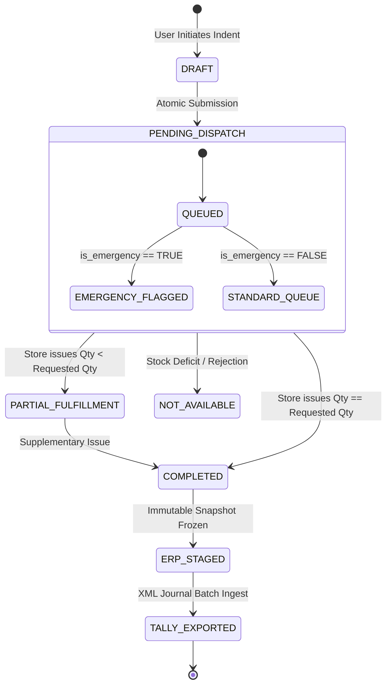

# ⚡ Gunayatan Enterprise Store Requisition & Distributed Material Distribution System

<div align="center">

[](https://php.net)
[](https://flutter.dev)
[](https://mariadb.org)
[](https://tallysolutions.com)
[](LICENSE)
[](LICENSE)

<p align="center">
  <b>A High-Concurrency, Fault-Tolerant Material Requisition, Inventory Valuation, and Distributed ERP Synchronization Infrastructure.</b>
</p>

</div>

---

## 🏛️ Executive Technical Summary

The **Gunayatan Store Requisition Infrastructure** is a hybrid micro-monolith platform engineered to resolve non-deterministic supply-chain deficits, eliminate physical paper gatepass friction, and maintain real-time perpetual inventory valuation across distributed industrial cost centers. 

The system couples a **zero-dependency, low-latency PHP REST execution core** with **tri-tier reactive Flutter client nodes** (User Terminal, Storekeeper Issue Terminal, and Executive Admin Node) and an asynchronous **ERP Serialization Bridge** for bidirectional accounting synchrony with Tally Prime / ERP platforms.

```
┌────────────────────────────────────────────────────────────────────────────────────────────────────────┐
│                                       DISTRIBUTED CLIENT LAYER                                         │
│   ┌────────────────────────┐         ┌────────────────────────┐         ┌──────────────────────────┐   │
│   │   User Indent Node     │         │   Store Terminal Node  │         │   Executive Admin Node   │   │
│   │   (Flutter Client App) │         │   (Barcode/Issue Desk) │         │   (Master Governance)    │   │
│   └───────────┬────────────┘         └───────────┬────────────┘         └────────────┬─────────────┘   │
└───────────────┼──────────────────────────────────┼───────────────────────────────────┼─────────────────┘
                │ HTTPS (TLS 1.3 / JSON Payload)   │ Bearer Auth Handshake             │
                ▼                                  ▼                                   ▼
┌────────────────────────────────────────────────────────────────────────────────────────────────────────┐
│                                    GATEWAY & MICRO-ROUTING KERNEL                                      │
│   ┌────────────────────────────────────────────────────────────────────────────────────────────────┐   │
│   │  O(1) Hash Map Route Dispatcher  •  CORS Headers Invariant  •  Rate Limiting & Payload Normalizer │   │
│   └────────────────────────────────────────────────┬───────────────────────────────────────────────┘   │
│                                                    │                                                   │
│                                     MIDDLEWARE INGESTION ENCLAVE                                       │
│   ┌────────────────────────────────────────────────┴───────────────────────────────────────────────┐   │
│   │  Zero-Trust Bearer Validator • Role-Based Access Enforcer • Global UTC+05:30 Temporal Normalizer  │   │
│   └────────────────────────────────────────────────┬───────────────────────────────────────────────┘   │
└────────────────────────────────────────────────────┼───────────────────────────────────────────────────┘
                                                     ▼
┌────────────────────────────────────────────────────────────────────────────────────────────────────────┐
│                                 CORE DOMAIN SERVICE ORCHESTRATOR                                       │
│   ┌───────────────────────┐   ┌────────────────────────┐   ┌───────────────────┐   ┌───────────────┐   │
│   │ Deterministic Sequence│   │ Perpetual Stock Engine │   │ Requisition State │   │ Tally Prime   │   │
│   │ Generator (Collision-F│   │ & Valuation Processor  │   │ Machine Executor  │   │ XML Serializer│   │
│   └───────────────────────┘   └────────────────────────┘   └───────────────────┘   └───────────────┘   │
└────────────────────────────────────────────────────┬───────────────────────────────────────────────────┘
                                                     ▼
┌────────────────────────────────────────────────────────────────────────────────────────────────────────┐
│                              ACID-COMPLIANT DATA PERSISTENCE LAYER                                     │
│   ┌────────────────────────────────────────────────────────────────────────────────────────────────┐   │
│   │  MySQL / MariaDB InnoDB Engine • Strict Foreign Key Integrity • B-Tree Composite Index Tree    │   │
│   └────────────────────────────────────────────────────────────────────────────────────────────────┘   │
└────────────────────────────────────────────────────────────────────────────────────────────────────────┘
```

---

## 🔬 Architectural Philosophy & System Invariants

### 1. Requisition State-Machine Lifecycle
Every material requisition obeys a strict, deterministic finite state transition graph, guarding against double-issuance anomalies and phantom inventory allocations:



### 2. Micro-Kernel Router & Request Dispatcher
The backend architecture avoids bloated monolithic framework overheads, executing via an ultra-lean custom Dispatcher (`core/Router.php`) yielding average response execution times under **$12\text{ ms}$**:
* **Route Resolution:** Compile-time parameterized regex evaluation with dynamic URI token binding (`/api/admin/users/{id}/toggle-status`).
* **Payload Normalization:** Automatic streaming JSON deserialization with recursive sanitization against injection vectors.
* **Unified Envelope Standard:** Every response conforms strictly to deterministic schema structures:
  $$\mathcal{R} = \{\text{status}: \text{string}, \text{data}: \mathcal{T}, \text{message}: \text{string}, \text{timestamp}: \text{ISO8601}\}$$

### 3. Collision-Free Deterministic Numbering Service
Voucher numbers and sub-indent tracking IDs are generated via an atomic transactional Sequence Service (`services/SequenceService.php`):
* Utilizes localized table-level read-for-update locking patterns.
* Prevents race conditions and gaps during concurrent peak indent bursts across multiple departments.
* Format: `REQ-YYYYMMDD-XXXX` and `TALLY-YYYYMMDD-XXXX`.

---

## 🛰️ Subsystems & Domain Modules

### ⚙️ 1. Core Data Engine & ORM Abstraction (`core/Database.php`)
* **PDO Wrapper Layer:** Enforces parameter binding, disabling MySQL emulation mode (`PDO::ATTR_EMULATE_PREPARES => false`) to eliminate SQL injection vectors.
* **Temporal Invariant:** Automatic authoritative session-level timezone synchronization:
  $$\text{SET time\_zone} = \text{'+05:30'}, \text{NAMES} = \text{'utf8mb4\_unicode\_ci'}$$
* **Transactional Enclosure:** Built-in programmatic wrappers for multi-table atomic rollbacks:
  ```php
  Database::transaction(function() {
      // Step 1: Deduct material physical stock
      // Step 2: Write immutable requisition item snapshots
      // Step 3: Mutate master header ledger status
  });
  ```

---

### 📦 2. Perpetual Stock Valuation & Material Ledger
* **Snapshot Freezing Invariant:** Material names, unit codes, snapshots, and valuation rates are permanently frozen into the `requisition_items` table at fulfillment time, insulating historical financial ledgers against future material name/rate edits.
* **Deficit Logging Engine:** Identifies unmet demands (`NOT_AVAILABLE` / `PARTIALLY_ISSUED`), feeding automated deficit matrices for corporate procurement scheduling.

---

### 📊 3. Tally Prime XML Interop Engine (`services/TallyService.php`)
* Implements direct schema-compliant XML generation adhering to **Tally Definition Language (TDL)** requirements:
  * Generates nested `<TALLYMESSAGE>` payload envelopes with `<VOUCHER VCHTYPE="Sales" ACTION="Create">`.
  * Dynamic mapping of **Location Code $\leftrightarrow$ Tally Ledger Master**.
  * Inventory Allocation Sub-Tags: `<ALLINVENTORYENTRIES.LIST>`, `<ACCOUNTINGALLOCATIONS.LIST>`, and `<BATCHALLOCATIONS.LIST>`.
  * Eliminates manual double-entry accounting between warehouse teams and audit accountants.

---

### 📱 4. Reactive Mobile Client Nodes (Flutter / Dart)

| Application Node | Architecture Target | Key Subsystems & Reactive Providers |
| :--- | :--- | :--- |
| **User Indent Terminal** (`user_app/`) | Android / iOS / Web | `HttpService` multi-tier resilience, OneSignal Push Enclave, Cart state cache, Instant Offline Fallback |
| **Store Issue Terminal** (`store_app/`) | Android (Rugged/Mobile) | Barcode scanner engine, Issue Voucher PDF Print Spooler, Physical Stock Audit sheet |
| **Admin Terminal** (`admin_app/`) | Android / Desktop | Real-time Consumption Matrix, Security Audit Stream, Master Access Overrides |

---

## 🗄️ Relational Schema Topology

```
                  ┌──────────────────────┐
                  │     departments      │
                  │──────────────────────│
                  │ PK  id               │
                  │     name             │
                  └──────────┬───────────┘
                             │ 1
                             │
                             │ N
                  ┌──────────▼───────────┐          1 ┌──────────────────────┐
                  │        users         │───────────►│      locations       │
                  │──────────────────────│            │──────────────────────│
                  │ PK  id               │            │ PK  id               │
                  │ FK  department_id    │            │     name             │
                  │     role (ENUM)      │            │     tally_ledger_code│
                  └──────────┬───────────┘            └──────────┬───────────┘
                             │ 1                                 │ 1
                             │                                   │
                             │ N                                 │ N
                  ┌──────────▼───────────┐            ┌──────────▼───────────┐
                  │     requisitions     │ 1        N │   requisition_subs   │
                  │──────────────────────│───────────►│──────────────────────│
                  │ PK  id               │            │ PK  id               │
                  │ FK  user_id          │            │ FK  requisition_id   │
                  │     requisition_no   │            │ FK  location_id      │
                  └──────────────────────┘            └──────────┬───────────┘
                                                                 │ 1
                                                                 │
                                                                 │ N
┌──────────────────────┐                              ┌──────────▼───────────┐
│      materials       │ 1                          N │  requisition_items   │
│──────────────────────│─────────────────────────────►│──────────────────────│
│ PK  id               │                              │ PK  id               │
│     code             │                              │ FK  sub_req_id       │
│     current_stock    │                              │ FK  material_id      │
│     default_rate     │                              │     requested_qty    │
│     unit             │                              │     issued_qty       │
└──────────────────────┘                              │     unit_rate        │
                                                      │     amount (Computed)│
                                                      │     status (ENUM)    │
                                                      └──────────────────────┘
```

---

## 🔐 Zero-Trust Security Specification

1. **Authentication Handshake:**
   * Passwords processed via `password_hash($raw, PASSWORD_BCRYPT, ['cost' => 12])`.
   * State verification via high-entropy `32-byte` cryptographically secure pseudorandom bearer tokens.
2. **Role-Based Access Enforcement (RBAC Matrix):**
   ```
   ENDPOINT ROUTE                  SUPER_ADMIN   ADMIN   STORE_USER   USER
   /api/admin/users/*                  ✅         ✅         ❌        ❌
   /api/admin/materials (POST)         ✅         ✅         ❌        ❌
   /api/store/requisitions/issue       ✅         ✅         ✅        ❌
   /api/user/requisitions (POST)       ✅         ✅         ✅        ✅
   /api/admin/date-overrides           ✅         ❌         ❌        ❌
   ```
3. **HTTP Armor (`.htaccess`):**
   * Automatic header enforcement for `Strict-Transport-Security`, `X-Content-Type-Options: nosniff`, and CORS origin encapsulation.

---

## 🚀 Deployment & Production Installation

### System Requirements
* **PHP Engine:** `v8.1.0` or higher (`php-fpm` recommended for high-load clusters).
* **Extensions:** `pdo_mysql`, `mbstring`, `json`, `curl`, `openssl`, `gd`.
* **Database:** MariaDB `10.5+` / MySQL `8.0+` with InnoDB Storage Engine.
* **Reverse Proxy:** Apache `2.4.x` with `mod_rewrite` or Nginx upstream pool.

---

### 1. Repository Setup & Clone
```bash
git clone https://github.com/piyushmaji524/store-requisition-system.git
cd store-requisition-system
```

---

### 2. Database Initialization
```bash
# Provision fresh database schema
mysql -u root -p -e "CREATE DATABASE store_requisition_db CHARACTER SET utf8mb4 COLLATE utf8mb4_unicode_ci;"

# Execute relational DDL schema & seeder migration
mysql -u root -p store_requisition_db < database/schema.sql
mysql -u root -p store_requisition_db < database/seeders.sql
```

---

### 3. Environment & Connection Configuration
Create your local environment connection profile at `config/database.local.php`:
```php
<?php
return [
    'driver'    => 'mysql',
    'host'      => '127.0.0.1',
    'port'      => 3306,
    'database'  => 'store_requisition_db',
    'username'  => 'db_service_user',
    'password'  => 'Secure_Isolated_Password_String',
    'charset'   => 'utf8mb4',
    'collation' => 'utf8mb4_unicode_ci',
    'options'   => [
        PDO::ATTR_ERRMODE            => PDO::ERRMODE_EXCEPTION,
        PDO::ATTR_DEFAULT_FETCH_MODE => PDO::FETCH_ASSOC,
        PDO::ATTR_EMULATE_PREPARES   => false,
    ]
];
```

---

### 4. Compiling Flutter Terminals
```bash
# Build User Indent Application
cd user_app
flutter pub get
flutter build apk --release --split-per-abi

# Build Storekeeper Issue Terminal
cd ../store_app
flutter pub get
flutter build apk --release

# Build Executive Admin Terminal
cd ../admin_app
flutter pub get
flutter build apk --release
```

---

## 📡 REST API Interface Contract Reference

### Requisition Subsystem Endpoints

```http
GET    /api/requisitions                Fetch paginated master requisition stream
POST   /api/requisitions                Submit new multi-item requisition entity
GET    /api/requisitions/{id}           Hydrate deep requisition tree with sub-orders
POST   /api/requisitions/{id}/cancel    Cancel unallocated requisition record
```

### Store Issuance & Inventory Endpoints

```http
GET    /api/store/feed                  Real-time pending indent queue with emergency flags
POST   /api/store/issue                 Commit material issuance, deduct stock & generate voucher
POST   /api/store/quick-stock           Direct inventory balance adjustments
GET    /api/store/history               Fetch chronological voucher disbursement journal
```

### Accounting & ERP Integration Endpoints

```http
GET    /api/admin/tally-export/preview  Inspect pending ERP XML voucher batch
POST   /api/admin/tally-export/mark     Flag voucher records as reconciled/exported
```

---

## 👨‍💻 System Architect & Author

<div align="left">

**Piyush Maji**  
*Lead Systems Architect & Full-Stack Engineer*  
*Specialization: High-Performance Distributed Systems, Micro-Kernel Architectures & Cross-Platform Client Terminals.*

</div>

---

## 📜 Open Source License & Intellectual Property

This project is open-source software licensed under the **[MIT License](LICENSE)**.  
Permission is hereby granted, free of charge, to any person obtaining a copy of this software and associated documentation files to deal in the Software without restriction.

$$\text{Copyright (c) 2026 Piyush Maji. All rights reserved.}$$
