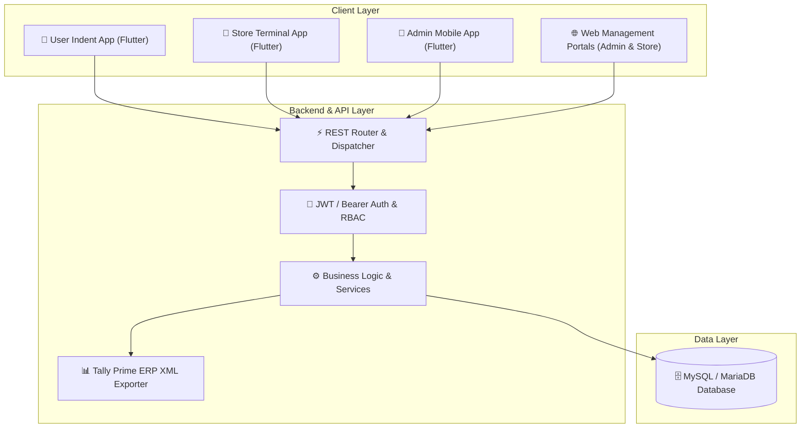

# 📦 Gunayatan Store Requisition & Management System

[](LICENSE)
[](https://www.php.net/)
[](https://flutter.dev/)
[](https://www.mysql.com/)
[](https://tallysolutions.com/)

A comprehensive, enterprise-grade **Store Requisition, Inventory Management, and Material Distribution Ecosystem**. Built with a lightweight, high-performance PHP REST API backend, intuitive web management portals, and multi-client Flutter mobile terminals for **Requesters**, **Storekeepers**, and **System Administrators**.

---

## 🏗️ Architecture & Component Overview



---

## ✨ Key Features & Ecosystem Modules

### 1. 🌐 Web Management Portals
* **Admin Control Panel (`/admin/`):**
  * Master User lifecycle, role-based access control (RBAC), and department assignments.
  * Master Material Catalogue with live stock balances, unit rates, and category classification.
  * Location Masters with Tally Ledger code mappings.
  * Requisition approval workflow, emergency issue oversight, and date override management.
  * Real-time activity logs and security audit trails.
* **Store Issue Desk (`/store/`):**
  * Live pending indents queue with emergency alert priority badges.
  * 1-Click material issue, partial fulfillment, and stock deficit logging.
  * Issue Voucher printing & Gatepass generation with recipient signature capture.
  * Automated Tally XML export for ledger reconciliation.

### 2. 📱 Flutter Cross-Platform Client Terminals
* **User Indent App (`user_app/`):**
  * Instant catalogue search, material stock availability check, and multi-item requisition cart.
  * Live status tracking (Pending → Partially Issued → Issued).
  * Emergency breakdown flags with real-time push notifications via OneSignal.
* **Store Terminal App (`store_app/`):**
  * Warehouse floor issuance with barcode scanning and physical inventory verification.
  * Quick stock adjustment and receipt queue.
* **Admin Mobile App (`admin_app/`):**
  * Real-time executive consumption dashboard and emergency breakdown monitor.
  * Quick user status toggle and password reset facility.

### 3. 📊 ERP & Accounting Integration
* Built-in **Tally Prime XML Engine** (`services/TallyService.php`) converting approved store issues into structured sales/consumption vouchers with cost center & location tags.

---

## 📁 Repository Structure

```
STORE_REQUISITION/
├── admin/                  # Web Admin Control Panel
├── admin_app/              # Flutter Admin Mobile App
├── api/                    # REST API Endpoints & Routes (Router, Handlers)
├── assets/                 # Shared Web Assets (CSS, JS, Logos, Icons)
├── config/                 # Application & Database Configuration
│   ├── config.php          # Global Application Constants & Timezones
│   ├── database.php        # DB Connection Loader
│   └── database.example.php# Sample DB Config Template
├── core/                   # Core Framework Libraries (Auth, Database PDO, Router, Logger)
├── database/               # Relational Schema & Initial Seeders
│   ├── schema.sql          # Complete DDL Schema
│   └── seeders.sql         # Default Admin & Master Data Seeders
├── PRD/                    # Product Requirements & Architecture Screenshots
├── services/               # Enterprise Business Services (Admin, Sequence, Tally, Time)
├── store/                  # Web Storekeeper Terminal Panel
├── store_app/              # Flutter Store Terminal Mobile App
├── user_app/               # Flutter User Indent Mobile App
├── index.php               # Unified Enterprise Landing Page & APK Download Hub
├── .htaccess               # Apache URL Rewriting & Security Headers
├── .gitignore              # Git Ignore Rules
├── LICENSE                 # MIT License
└── README.md               # Project Documentation
```

---

## 🚀 Getting Started & Installation

### Prerequisites
* **Web Server:** Apache 2.4+ (with `mod_rewrite` & `mod_headers` enabled) or Nginx.
* **PHP:** PHP 8.1 or higher (Extensions required: `pdo_mysql`, `mbstring`, `json`, `curl`).
* **Database:** MySQL 5.7+ / MariaDB 10.3+.
* **Flutter SDK:** Flutter 3.19+ (if building/modifying mobile apps).

---

### Step 1: Clone Repository
```bash
git clone https://github.com/piyushmaji524/store-requisition-system.git
cd store-requisition-system
```

---

### Step 2: Database Setup
1. Create a MySQL database (e.g., `store_requisition_db`).
2. Import the schema and initial seeders:
   ```bash
   mysql -u root -p store_requisition_db < database/schema.sql
   mysql -u root -p store_requisition_db < database/seeders.sql
   ```

---

### Step 3: Configure Database Credentials
Create a local configuration file `config/database.local.php` (this file is git-ignored):
```php
<?php
return [
    'driver'    => 'mysql',
    'host'      => 'localhost',
    'port'      => '3306',
    'database'  => 'store_requisition_db',
    'username'  => 'your_db_username',
    'password'  => 'your_db_password',
    'charset'   => 'utf8mb4',
    'collation' => 'utf8mb4_unicode_ci',
    'options'   => [
        PDO::ATTR_ERRMODE            => PDO::ERRMODE_EXCEPTION,
        PDO::ATTR_DEFAULT_FETCH_MODE => PDO::FETCH_ASSOC,
        PDO::ATTR_EMULATE_PREPARES   => false,
    ]
];
```
*Alternatively, you can configure environment variables: `DB_HOST`, `DB_DATABASE`, `DB_USERNAME`, `DB_PASSWORD`.*

---

### Step 4: Run Flutter Apps (Optional)
Navigate to any app folder and launch on an emulator or physical device:
```bash
# User App
cd user_app
flutter pub get
flutter run

# Store Terminal App
cd ../store_app
flutter pub get
flutter run

# Admin App
cd ../admin_app
flutter pub get
flutter run
```

---

## 🔒 Security Best Practices
* **Parameterized Queries:** All SQL transactions use PDO prepared statements to eliminate SQL Injection risks.
* **Password Hashing:** Passwords hashed with standard `BCRYPT`.
* **RBAC Enforcement:** Fine-grained role checks (`SUPER_ADMIN`, `ADMIN`, `STORE_USER`, `USER`).
* **Audit Trail:** Critical actions logged in `activity_logs` table with IP addresses and user agents.

---

## 👤 Author & Maintainer

* **Piyush Maji**
  * Lead System Architect & Full-Stack Developer
  * Project Author & Maintainer

---

## 📄 License

This project is open-source software licensed under the [MIT License](LICENSE).
Feel free to use, modify, and distribute it for personal and commercial projects.
